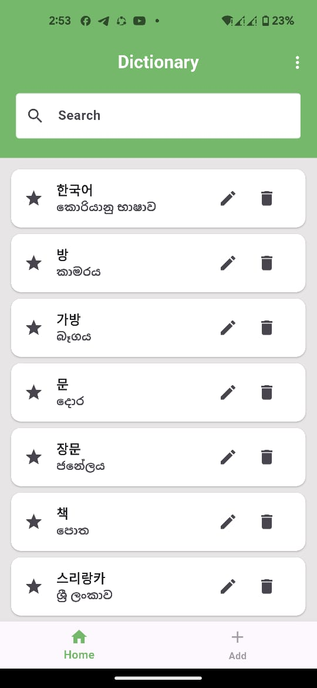
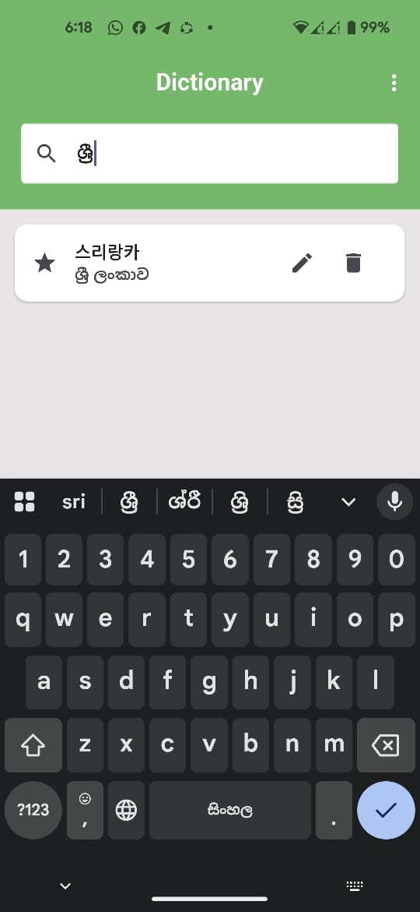
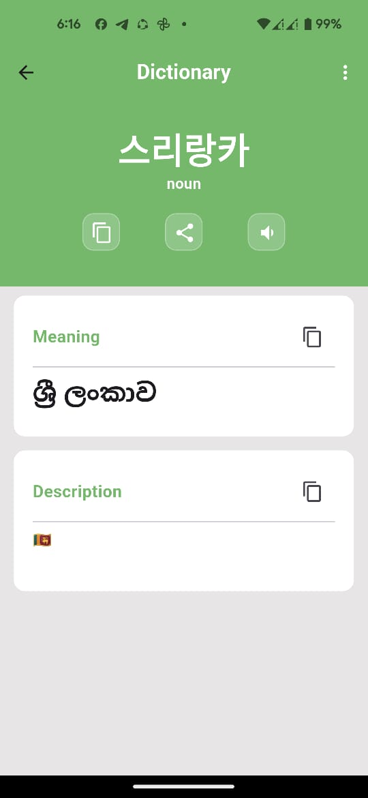
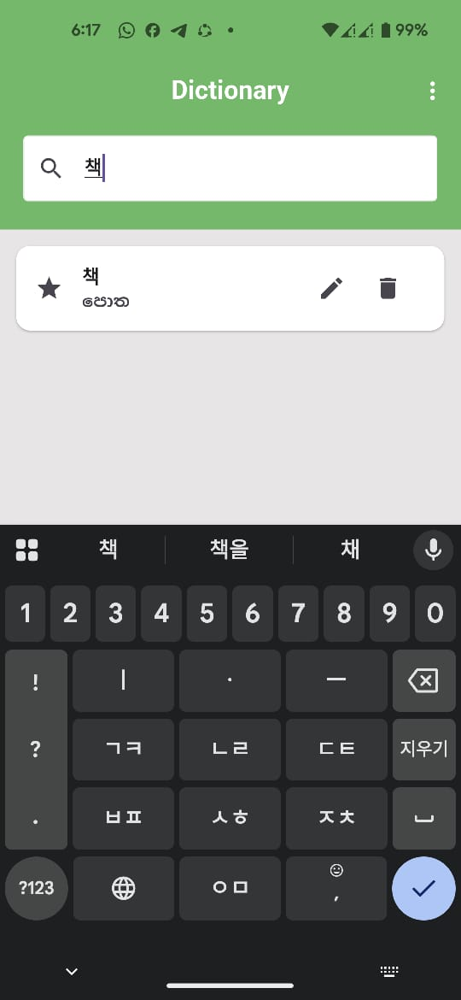
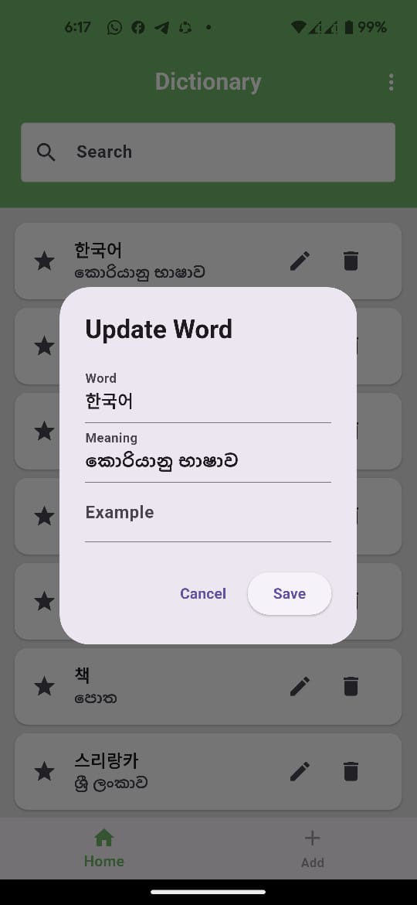
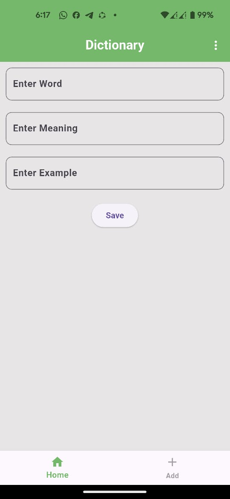

# Dictionary App

## 📖 About the App
This is a simple **Dictionary App** built with Flutter. It helps users manage their own collection of words.

## ✨ Features
- ➕ Add and store new words  
- 👀 View all saved words  
- 🔍 Search for specific words  
- ✏️ Update existing words  
- 🗑️ Delete unwanted words  

## App Screenshot

